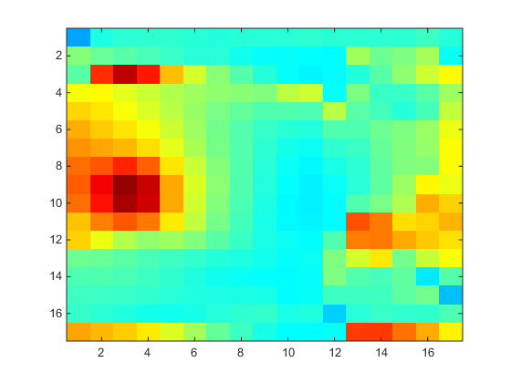

# SnapshotofSky

 Snapshot

Scanning the sky  with single photo-diode(with 2 servos) and
transmitting with [Xbee adapter](http://www.digi.com/products/xbee-rf-solutions/modules/xbee-pro-900hp) (Zigbee protocol).
This project is a part of a project intended to find the position of light
sources in sky and predicting the output of solar panel which will allow
optimization.

This project was divided among three systems: 

#Arduino and XBee: 
The XBee Pro was configured as End Device. The wireless was configured to talk with arduino using UART protocol.I used XBee library in arduino to interface with the wireless adapter.
the arduino was also controlling the servo and taking analog input from photocell.After every turn of secondary servos turn, xbee was sending a packet to host with the position of primary arm. 

#Xbee Adapter , Python and Matlab parser: 
Xbee serial adpater was used to interface between XBee cordinator and a Windows machine. Python serial library was used to handle the serial streaming of XBee(matlab proved to be slow). 
Due to an existing codebase in matlab, the data was transferred to matlab and parsed into a image.

#Example Snapshot

